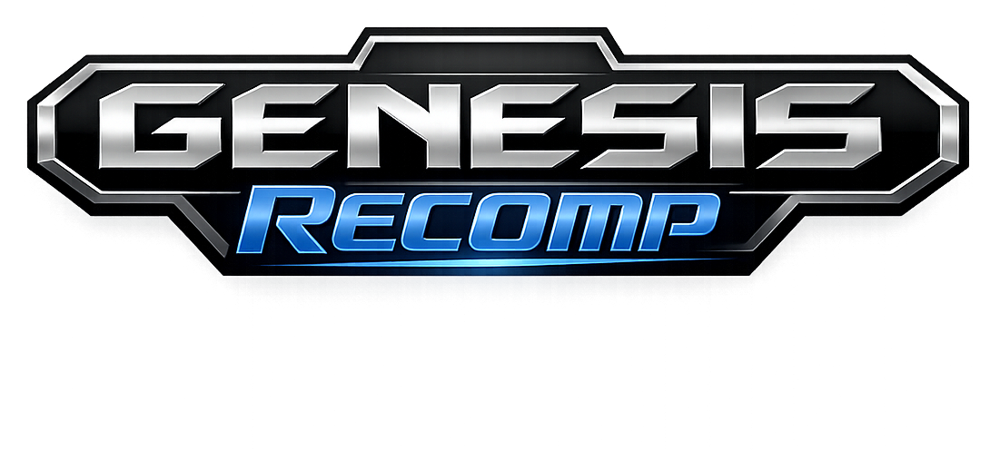

<p align="center">
  
</p>

# Genesis 68K Static Recompiler

A static recompiler that translates Sega Genesis (Mega Drive) 68000 ROM binaries into native C code. Paired with the [SonicTheHedgehogRecomp](https://github.com/mstan/SonicTheHedgehogRecomp) runner, **Green Hill Zone (all 3 acts + boss) is fully playable** with correct jumping, audio, sprite art, and object interactions.

## Status

| Feature | Status | Notes |
|---------|--------|-------|
| 68K instruction coverage | ✅ Comprehensive | All common instructions and addressing modes |
| `addq.l #4,sp` + `rts` pattern | ✅ Fixed | Function-local `_sp_popped` tracking for early-exit stack manipulation |
| Function discovery | ✅ 530+ functions | Static analysis + runtime dispatch miss logging + interpreter coverage |
| Interior label detection | ✅ Automated | Binary search on dispatch table prevents split-function bugs |
| JMP/JSR table dispatch | ✅ Works | Computed jumps route through `call_by_address` |
| Per-instruction cycle costs | ✅ Estimated | Drives VBlank timing via `glue_check_vblank` |
| Generated code correctness | ✅ GHZ verified | All 3 acts completable, boss fight works |
| Later zones | ⚠️ Partial | Functions discovered progressively via gameplay |
| Sound Z80 static recompilation | Experimental | Optional flat-step backend; see [docs/Z80_STATIC_RECOMP.md](docs/Z80_STATIC_RECOMP.md) |

## What's In This Repo

| Directory | Purpose |
|-----------|---------|
| `recompiler/src/` | The recompiler tool — analyzes ROM binary, emits native C |
| `runner/include/` | Shared runtime headers (`genesis_runtime.h`) |
| `clownmdemu-core/` | [clownmdemu](https://github.com/Clownacy/clownmdemu) emulator core — **pinned submodule, development only**. Conformance oracle for the unshipped `_oracle` builds; AGPL-3.0. Native (release) targets compile and link **zero** code from it — enforced by the CMake include lists; see `RELEASING.md` / `LICENSING.md` |
| `<game build>/generated/<prefix>/` | Ignored output regenerated from the ROM, config, and current recompiler |
| `sonicthehedgehog/game.cfg` | Recompiler config — 530 extra_func entries |

## How It Works

The recompiler (`recompiler/src/code_generator.c`) decodes every 68K instruction in the ROM and emits equivalent C code. Each 68K subroutine becomes a C function operating on the same `M68KState` (D0–D7, A0–A7, SR) and memory layout as the original.

Key recompiler features:
- **`addq.l #4,sp` early-exit detection**: Pre-scans each function for stack pointer adjustments. Emits local `_sp_popped` counter so `rts` propagates returns through the caller's post-JSR check via `g_rte_pending`.
- **Dispatch table accessor generation**: `game_dispatch_table_size()` and `game_dispatch_table_addr()` enable runtime interior label detection.
- **Per-instruction cycle estimation**: Each instruction emits `g_cycle_accumulator += N` for VBlank timing.

## Cloning

```bash
git clone --recursive https://github.com/mstan/segagenesisrecomp.git
```

## Platform Support

The runner builds and runs natively on **Windows (MSVC)**, **macOS (Apple
Silicon & Intel)**, and **Linux**. The cooperative game-fiber scheduler is
backed by Win32 Fibers on Windows and by `ucontext` on macOS/Linux via
`runner/fiber_compat.{h,c}`; SDL2 handles windowing, rendering, audio, and
`SDL_GameController` gamepads on all platforms. See the
[SonicTheHedgehogRecomp](https://github.com/mstan/SonicTheHedgehogRecomp)
README for per-platform build steps.

## Building the Recompiler

The recompiler is portable C++ and builds on any platform with a C++ toolchain.

```bash
cd recompiler

# Windows (MSVC)
cmake -S . -B build -G "Visual Studio 17 2022" -A x64
cmake --build build --config Release

# macOS / Linux (Ninja)
cmake -S . -B build -G Ninja -DCMAKE_BUILD_TYPE=Release
ninja -C build
```

## Regenerating Output

```bash
cd sonicthehedgehog
../recompiler/build/Release/GenesisRecomp.exe sonic.bin --game game.toml --output-dir generated
```

The manual command writes ignored files under `generated/`. Normal game CMake
builds isolate them under that build tree's `generated/<prefix>/` directory
and rebuild whenever the ROM, game config, discovery inputs, annotations,
recompiler, or generation options change. Generated C is deliberately not
tracked in Git.

## Building and Running the Game

See **[SonicTheHedgehogRecomp](https://github.com/mstan/SonicTheHedgehogRecomp)** for build instructions, controls, and known issues.

## Audio & Video Enhancements (opt-in)

The runner ships an optional **verified-enhancement shadow** layer: quality-of-life
audio/video improvements that run *alongside* the authentic hardware emulation
without ever replacing it as ground truth. The governing rule (see
[`docs/SHADOW_ENHANCEMENTS.md`](docs/SHADOW_ENHANCEMENTS.md)):

- The authentic (canon) path stays the authoritative output **and** the verify
  oracle — the shadow is never ground truth.
- The shadow is continuously diff-checked against canon and substitutes **only
  after a proven correlation window**.
- It **reverts loudly** (logs `[AUDIO-SHADOW] DEGRADED …`) the instant it stops
  matching.
- It is **off by default**. With it off, output is byte-identical to the raw
  hardware emulation (the `[FBHASH]` framebuffer hash, PNG dumps, and WAV capture
  all stay on the raw canon). Worst case when on is "you see/hear authentic
  hardware output," and it cannot mask a recompiler bug because the canon path it
  shadows is still the thing being diffed.

All options are environment variables, default OFF:

| Variable | Values | Effect |
|----------|--------|--------|
| `GENESIS_SCREEN` | `raw` (default), `crt`, `trinitron`, `composite`, `linear` | Present-time color model. `raw` reproduces the existing 9-bit→ARGB8888 expansion bit-identically. The others map the Genesis 9-bit (BGR 3-3-3) gamut through a CIE color core (panel primaries → sRGB via Bradford + sRGB OETF): `crt` = generic SMPTE-C phosphor + γ≈2.4 + lifted black, `trinitron` = Sony P22-ish primaries, `composite` = gentler γ + higher black floor, `linear` = clean linear-light reference. Per-pixel color only — it does **not** synthesize composite/RF spatial artifacts (dot crawl, cross-color, NTSC blur). |
| `GENESIS_AUDIO_SHADOW` | `0` (default) / `1` | Arms the YM2612 FM shadow. A second `ymfm` chip is fed the identical register-write stream as the canon chip but rendered with a **relaxed output low-pass** (near-passthrough) instead of the aggressive filter canon uses to match the reference — preserving the cleaner, less-aliased high end. Gain is identical; the verifier substitutes the FM stereo samples only once proven. The SN76489 (PSG) path is untouched. |
| `GENESIS_FM_LADDER` | unset (default) / `off` | When `off`, the FM shadow renders through ymfm's **`ym3438`** chip — the same FM engine without the YM2612's DAC "ladder" discontinuity (the ~7-LSB crossover gap around zero, i.e. the audible low-level crunch). This is the later CMOS Genesis FM revision that fixed it; no hand-rolled correction curve. Requires `GENESIS_AUDIO_SHADOW=1`. Verifier-policed like any other enhancement. |

Example (all on):

```bash
GENESIS_AUDIO_SHADOW=1 GENESIS_FM_LADDER=off GENESIS_SCREEN=crt \
    ./Sonic3KRecomp sonic3k.bin
```

These are present-time/runtime only and link no clownmdemu — they are part of
the AGPL-free native runtime and safe to ship. To wire them into a game build,
add `runner/audio/audio_shadow.c`, `runner/audio/fm_shadow.cpp`, and
`runner/video/color_lut.c` to that game's source list (the `video/` and
`external/ymfm/src` include dirs are already present). See
[`docs/SHADOW_ENHANCEMENTS.md`](docs/SHADOW_ENHANCEMENTS.md) for the full design,
verifier algorithm, and integration points.

### Widescreen (16:9, opt-in)

`GENESIS_WIDESCREEN=1` renders a 16:9 viewport (default 448px wide, configurable
via `GENESIS_WIDESCREEN_COLUMNS=<cells/side>`) in place of the authentic 4:3
320px. The clean-room VDP draws extra **centered** columns; the recompiled 68K
reads a per-frame `Widescreen_extra` RAM word (written by the runner) to widen
its own tile-load, object-cull, ring-window, and sprite bounds. The word is `0`
when the toggle is off, so **the authentic 4:3 output stays byte-identical**. It
is per-game and gameplay-gated — authentic 4:3 on menus, title cards, and
2-player split-screen. Supported in Sonic 1, Sonic 2, and the Sonic 3 family
(S3-alone and S&K-alone; the combined S3&K build is bring-up). See the
`[widescreen]` block in each `game.toml`.

The widening lives in the **game's 68K source**, so a widescreen build
reassembles a community disassembly into a patched ROM and recompiles that. With
widescreen off, that reassembly is byte-identical to the original ROM.

#### Disassembly sources

The optional widescreen builds are produced from these community Sega Genesis
disassemblies (build-time sources only — the shipped binaries are recompiled C,
and the 4:3 path reassembles byte-identically to the canonical ROMs):

- **Sonic the Hedgehog** — [Sonic Retro `s1disasm`](https://github.com/sonicretro/s1disasm)
- **Sonic the Hedgehog 2** — [Sonic Retro `s2disasm`](https://github.com/sonicretro/s2disasm)
- **Sonic 3 & Knuckles** — [Sonic Retro `skdisasm`](https://github.com/sonicretro/skdisasm)

With thanks to the Sonic Retro community for maintaining these disassemblies.

## Key Files

| File | Purpose |
|------|---------|
| `recompiler/src/code_generator.c` | Main codegen — 68K → C translation, `_sp_popped` pattern, cycle estimation |
| `recompiler/src/m68k_decoder.c` | 68K instruction decoder |
| `runner/include/genesis_runtime.h` | Shared interface: `M68KState`, `g_rte_pending`, `g_early_return`, bus access |
| `<game build>/generated/<prefix>/*_full.c` | Ignored build output containing generated functions |
| `<game build>/generated/<prefix>/*_dispatch.c` | Ignored build output containing the dispatch table |
| `sonicthehedgehog/game.cfg` | 530 extra_func entries — discovered via runtime logging + interpreter coverage |

## License

[PolyForm Noncommercial 1.0.0](LICENSE.md) — free for non-commercial use.

`clownmdemu-core/` is third-party code with its own license. See `clownmdemu-core/LICENCE.txt`.

---

<p align="center">
  <sub><b>R.A.I.D. — Retro AI Development</b> · a Discord for AI-assisted retro reverse-engineering, decomp &amp; recomp</sub>
</p>

<p align="center">
  <a href="https://discord.gg/Ad9BwSzctP"></a>
</p>
